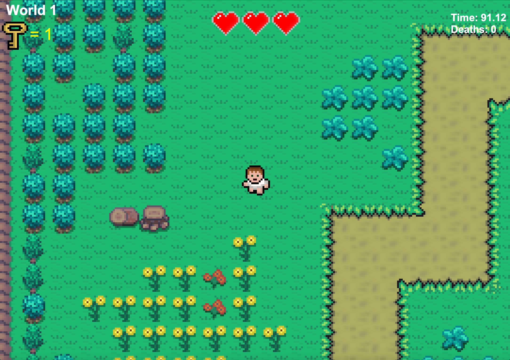
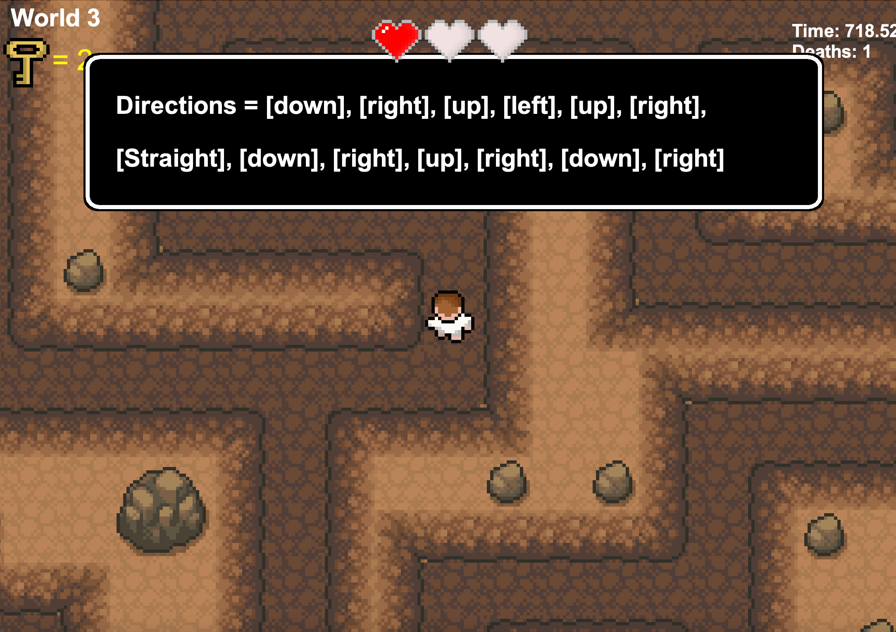
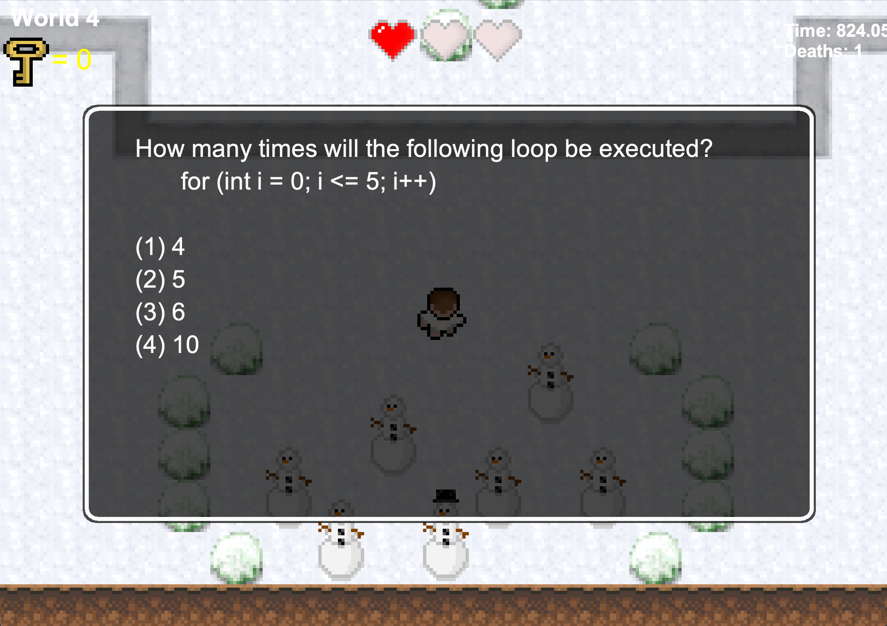
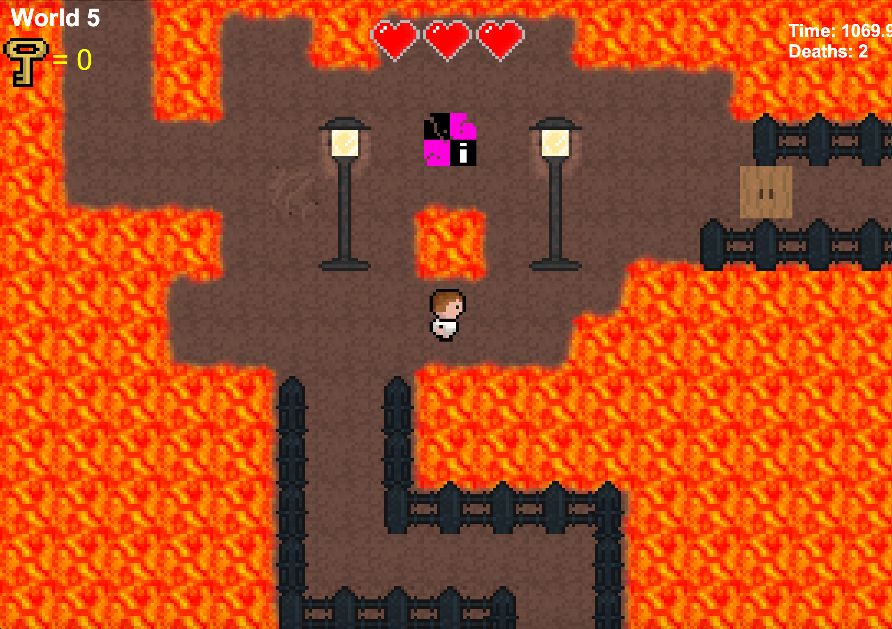

# Riddled With Errors

This is a Zelda themed, top-down game designed to test basic CS concepts.  
Written entirely in Java, this game utilizes 2D Graphics and the Java Swing  
library to handle animations and rendering.
<br>

## Purpose and Our Goals
This project was done in conjunction with 4 other contributers for a Software  
engineering project at James Madison University. Our goal was to create a  
software that helped students stay interested in Computer Science. We noticed  
a disparity between students who take CS classes and students who enrol in the  
CS Major, so we decided to build a game that makes CS just a little more fun.
<br>

## What We Learned
This project was an oportunity to learn Agile methodologies and Scrum. As a  
group, we created project proposals, sprint reviews, backlogs, elected scrum  
masters, and much more.
<br>

## Contributers
*Benjamin Hawkins  
Andrew Bailey  
Triston Simmons  
Samyel Snyder  
William Stearns*   
<br>




<br>




<br>


## Future Ideas

> This project had a timeframe of 2 months, not nearly enough time for our   
> project team to complete what we wanted to. In the future, we hope to  
>  
> - implement music
> - create more levels
> - create an editor for teachers to create their won levels
> - create new maps for different topics
> - create new difficulties
> - add more unique puzzles
> - implement a global leaderboard
>  

<br>

## Installation

See Documentation for exporting Java Projects as JAR files to install the game. 

[Eclipse](https://www.albany.edu/faculty/jmower/geog/gog692/ImportExportJARFiles.htm)  
  
[InteliiJ](https://www.jetbrains.com/help/idea/compiling-applications.html#package_into_jar)  
  
[VsCode](https://dev.to/rohitk570/create-an-executable-jar-file-on-vs-code-n-command-line-154b)
  
To run the game as is, just clone the repository and run the main method located in 
```bash
/src/main/Main.java
```
